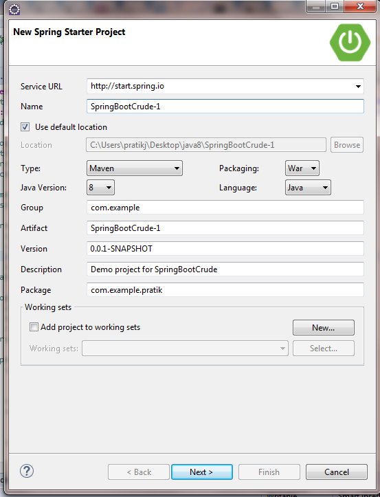
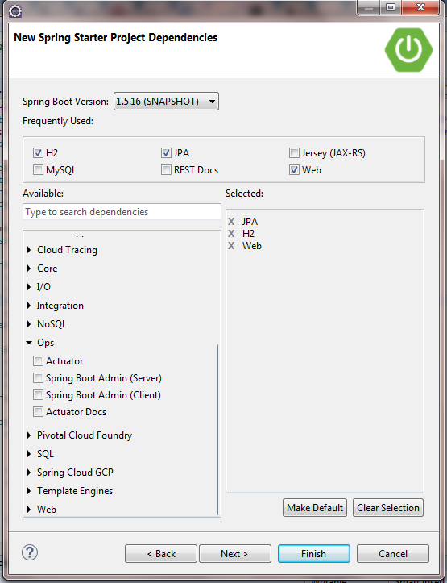
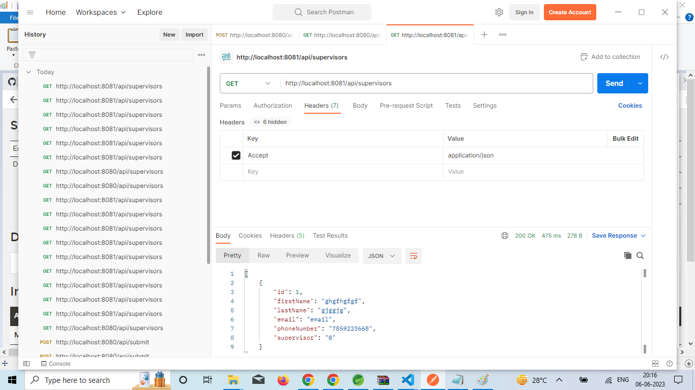
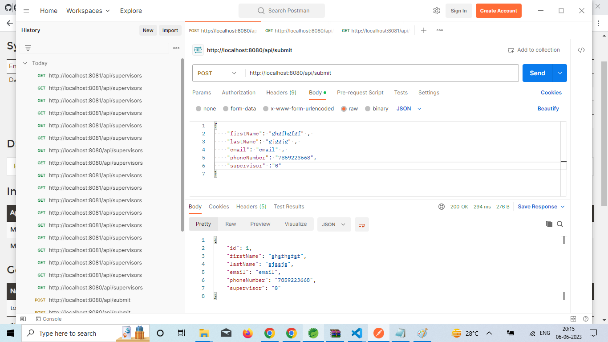

# MicroService With eureka

> In this tutorial you will know how to create Spring boot 2.6.4 MVC  example in simplest way.
### Project Structure


#### Step 1 - Let’s Setup Environment

1. Spring 2.6.4 
2. Maven 4 and any latest version
3. JDK 1.8 
4. STS

#### Step 2 - Create Project

> Click on File > New > Spring Starter project 




#### Step 3 - Create first Eureka server And Add Dipendency in ``pom.xml`` file 


```XML
<?xml version="1.0" encoding="UTF-8"?>
<project xmlns="http://maven.apache.org/POM/4.0.0" xmlns:xsi="http://www.w3.org/2001/XMLSchema-instance"
	xsi:schemaLocation="http://maven.apache.org/POM/4.0.0 https://maven.apache.org/xsd/maven-4.0.0.xsd">
	<modelVersion>4.0.0</modelVersion>
	<parent>
		<groupId>org.springframework.boot</groupId>
		<artifactId>spring-boot-starter-parent</artifactId>
		<version>2.6.4</version>
		<relativePath/> <!-- lookup parent from repository -->
	</parent>
	<groupId>com.example</groupId>
	<artifactId>user-service</artifactId>
	<version>0.0.1-SNAPSHOT</version>
	<name>user-service</name>
	<description>Demo project for Spring Boot</description>
	<properties>
		<java.version>1.8</java.version>
		<spring-cloud.version>2021.0.1</spring-cloud.version>
	</properties>
	<dependencies>
		<dependency>
			<groupId>org.springframework.boot</groupId>
			<artifactId>spring-boot-starter-data-jpa</artifactId>
		</dependency>
		<dependency>
			<groupId>org.springframework.boot</groupId>
			<artifactId>spring-boot-starter-web</artifactId>
		</dependency>
		<dependency>
            <groupId>org.springframework.kafka</groupId>
            <artifactId>spring-kafka</artifactId>
        </dependency>
        <dependency>
            <groupId>org.springframework.kafka</groupId>
            <artifactId>spring-kafka-test</artifactId>
            <scope>test</scope>
        </dependency>

		<dependency>
			<groupId>org.springframework.boot</groupId>
			<artifactId>spring-boot-devtools</artifactId>
			<scope>runtime</scope>
			<optional>true</optional>
		</dependency>
		<dependency>
			<groupId>org.projectlombok</groupId>
			<artifactId>lombok</artifactId>
			<optional>true</optional>
		</dependency>
		<dependency>
			<groupId>org.springframework.boot</groupId>
			<artifactId>spring-boot-starter-test</artifactId>
			<scope>test</scope>
		</dependency>
		
		<dependency>
			<groupId>org.springframework.cloud</groupId>
			<artifactId>spring-cloud-starter-netflix-eureka-server</artifactId>
		</dependency>
	</dependencies>
	
	<dependencyManagement>
    <dependencies>
      <dependency>
        <groupId>org.springframework.cloud</groupId>
        <artifactId>spring-cloud-dependencies</artifactId>
        <version>${spring-cloud.version}</version>
        <type>pom</type>
        <scope>import</scope>
      </dependency>
    </dependencies>
  </dependencyManagement>

	<build>
		<plugins>
			<plugin>
				<groupId>org.springframework.boot</groupId>
				<artifactId>spring-boot-maven-plugin</artifactId>
				<configuration>
					<excludes>
						<exclude>
							<groupId>org.projectlombok</groupId>
							<artifactId>lombok</artifactId>
						</exclude>
					</excludes>
				</configuration>
			</plugin>
		</plugins>
	</build>

</project>


```
#### Step 4 - Add application.properties in ``application.properties`` file here if we write the port of eureka server that is fine if we don't write that is also fine
```application.properties
server.port=8761
spring.application.name=EUREKA-SERVER
eureka.client.register-with-eureka=false
eureka.client.fetch-registry=false
<!-- End Here -->
```


#### Step 5 - Add all package to above structure
first i add com.exmaple.

And second one is SpringBootCrudeApplication
```JAVA
package com.example;

import org.springframework.boot.SpringApplication;
import org.springframework.boot.autoconfigure.SpringBootApplication;
import org.springframework.cloud.client.loadbalancer.LoadBalanced;
import org.springframework.cloud.netflix.eureka.server.EnableEurekaServer;
import org.springframework.context.annotation.Bean;
import org.springframework.kafka.annotation.EnableKafka;
import org.springframework.kafka.annotation.KafkaListener;
import org.springframework.web.client.RestTemplate;

@SpringBootApplication
@EnableEurekaServer
public class UserServiceApplication {

	public static void main(String[] args) {
		SpringApplication.run(UserServiceApplication.class, args);
	}

}
<!-- End Here -->
```

#### Step 6 - Create another project Manger client According above structure

#### Step 7 - Create first Eureka client And Add Dipendency in ``pom.xml`` file 


```XML
<?xml version="1.0" encoding="UTF-8"?>
<project xmlns="http://maven.apache.org/POM/4.0.0" xmlns:xsi="http://www.w3.org/2001/XMLSchema-instance"
	xsi:schemaLocation="http://maven.apache.org/POM/4.0.0 https://maven.apache.org/xsd/maven-4.0.0.xsd">
	<modelVersion>4.0.0</modelVersion>
	<parent>
		<groupId>org.springframework.boot</groupId>
		<artifactId>spring-boot-starter-parent</artifactId>
		<version>2.6.4</version>
		<relativePath/> <!-- lookup parent from repository -->
	</parent>
	<groupId>com.example</groupId>
	<artifactId>user-service</artifactId>
	<version>0.0.1-SNAPSHOT</version>
	<name>user-service</name>
	<description>Demo project for Spring Boot</description>
	<properties>
		<java.version>1.8</java.version>
		<spring-cloud.version>2021.0.1</spring-cloud.version>
	</properties>
	<dependencies>
		<dependency>
			<groupId>org.springframework.boot</groupId>
			<artifactId>spring-boot-starter-data-jpa</artifactId>
		</dependency>
		<dependency>
			<groupId>org.springframework.boot</groupId>
			<artifactId>spring-boot-starter-web</artifactId>
		</dependency>
		<dependency>
            <groupId>org.springframework.kafka</groupId>
            <artifactId>spring-kafka</artifactId>
        </dependency>
        <dependency>
            <groupId>org.springframework.kafka</groupId>
            <artifactId>spring-kafka-test</artifactId>
            <scope>test</scope>
        </dependency>
		<dependency>
			<groupId>org.apache.tomcat.embed</groupId>
			<artifactId>tomcat-embed-jasper</artifactId>
		</dependency>
		<dependency>
			<groupId>org.springframework.boot</groupId>
			<artifactId>spring-boot-devtools</artifactId>
			<scope>runtime</scope>
			<optional>true</optional>
		</dependency>
		<dependency>
			<groupId>com.h2database</groupId>
			<artifactId>h2</artifactId>
			<scope>runtime</scope>
		</dependency>
		<dependency>
			<groupId>org.projectlombok</groupId>
			<artifactId>lombok</artifactId>
			<optional>true</optional>
		</dependency>
		<dependency>
			<groupId>org.springframework.boot</groupId>
			<artifactId>spring-boot-starter-test</artifactId>
			<scope>test</scope>
		</dependency>
		
		<dependency>
		    <groupId>org.springframework.cloud</groupId>
		    <artifactId>spring-cloud-starter-netflix-eureka-client</artifactId>
		    <version>3.1.1</version>
		</dependency>
	</dependencies>
	
	<dependencyManagement>
    <dependencies>
      <dependency>
        <groupId>org.springframework.cloud</groupId>
        <artifactId>spring-cloud-dependencies</artifactId>
        <version>${spring-cloud.version}</version>
        <type>pom</type>
        <scope>import</scope>
      </dependency>
    </dependencies>
  </dependencyManagement>

	<build>
		<plugins>
			<plugin>
				<groupId>org.springframework.boot</groupId>
				<artifactId>spring-boot-maven-plugin</artifactId>
				<configuration>
					<excludes>
						<exclude>
							<groupId>org.projectlombok</groupId>
							<artifactId>lombok</artifactId>
						</exclude>
					</excludes>
				</configuration>
			</plugin>
		</plugins>
	</build>

</project>


```
com.example

```JAVA
package com.example;

import org.springframework.boot.SpringApplication;
import org.springframework.boot.autoconfigure.SpringBootApplication;
import org.springframework.cloud.netflix.eureka.EnableEurekaClient;

@SpringBootApplication
@EnableEurekaClient
public class UserServiceApplication {

	public static void main(String[] args) {
		SpringApplication.run(UserServiceApplication.class, args);
	}

}

```
com.example.controller

```JAVA
package com.example.controller;

import java.util.List;

import org.springframework.beans.factory.annotation.Autowired;
import org.springframework.web.bind.annotation.GetMapping;
import org.springframework.web.bind.annotation.PostMapping;
import org.springframework.web.bind.annotation.RequestBody;
import org.springframework.web.bind.annotation.RequestMapping;
import org.springframework.web.bind.annotation.RestController;

import com.example.entity.User;
//import com.example.service.UserService;
//import com.example.valueobject.ReponseTemplateVo;
import com.example.service.UserService;

@RestController
@RequestMapping("/api/")
public class SupervisorsController {
	
	@Autowired
	private UserService userService;
	
	
	@PostMapping("/submit")
	public User saveUser(@RequestBody User user) {
		System.out.println("Inside save User");
		System.out.println("user "+user.getFirstName());
		System.out.println("user "+user.getLastName());
		System.out.println("user "+user.getPhoneNumber());
		System.out.println("user "+user.getSupervisor());
		return userService.saveDepartement(user);
	}
	
	@GetMapping("/supervisors")
	public List<User> getUserWithDepartment() {
		System.out.println("Inside findUser By Id ");
		return userService.getAllUser();
		
	}
	
}


<!-- End Here -->
```
com.exaple.entity
```JAVA
package com.example.entity;

import javax.persistence.Column;
import javax.persistence.Entity;
import javax.persistence.GeneratedValue;
import javax.persistence.GenerationType;
import javax.persistence.Id;
import javax.persistence.Table;

import lombok.Data;

@Data
@Entity
@Table(name="supervisor")
public class User {
	
	
	@Id
	@GeneratedValue(strategy=GenerationType.AUTO)
	private Long id;
	
	@Column(name="first_name")
	private String firstName;
	
	@Column(name="last_nme")
	private String lastName;
	
	@Column(name="email")
	private String email;
	
	@Column(name="phone_number")
	private String phoneNumber;
	
	@Column(name="supervisor")
	private String supervisor;
	

	public Long getId() {
		return id;
	}


	public void setId(Long id) {
		this.id = id;
	}


	public String getFirstName() {
		return firstName;
	}


	public void setFirstName(String firstName) {
		this.firstName = firstName;
	}


	public String getLastName() {
		return lastName;
	}


	public void setLastName(String lastName) {
		this.lastName = lastName;
	}


	public String getEmail() {
		return email;
	}


	public void setEmail(String email) {
		this.email = email;
	}


	public String getPhoneNumber() {
		return phoneNumber;
	}


	public void setPhoneNumber(String phoneNumber) {
		this.phoneNumber = phoneNumber;
	}


	public String getSupervisor() {
		return supervisor;
	}


	public void setSupervisor(String supervisor) {
		this.supervisor = supervisor;
	}


	public User() {
		
	}


	@Override
	public String toString() {
		return "User [userId=" + id + ", firstName=" + firstName + ", lastName=" + lastName + ", email=" + email
				+ ", phoneNumber=" + phoneNumber + ", supervisor=" + supervisor + "]";
	}
	
	
}


<!-- End Here -->
```

com.example.service
```JAVA
package com.example.service;

import java.util.List;

import com.example.entity.User;
import com.example.model.UserData;

public interface UserService {

	public User saveDepartement(User user);

	public List<User> getAllUser();

}


<!-- End Here -->
```

```JAVA
package com.example.service;

import java.util.HashMap;
import java.util.List;
import java.util.Map;

import org.springframework.beans.factory.annotation.Autowired;
import org.springframework.kafka.annotation.KafkaListener;
import org.springframework.stereotype.Service;
import org.springframework.web.client.RestTemplate;

import com.example.entity.User;
import com.example.model.UserData;
import com.example.repository.UserRepository;

@Service
public class UserServiceImpl implements UserService {
	
	@Autowired
	private UserRepository userRepository;

	@Override
	public User saveDepartement(User user) {
		System.out.println("inside the UserService method of save user");
//		User u =  new User();
//		u.setFirstName(user.getFirstName());
//		u.setLastName(user.getLastName());
//		u.setEmail(user.getEmail());
//		u.setPhoneNumber(user.getPhoneNumber());
//		//u.setSupervisor(user.getSupervisor());
//		u.setSupervisor("");
		return userRepository.save(user);
	}

	@Override
	public List<User> getAllUser() {
		return userRepository.findAll();
	}
	

}


<!-- End Here -->
```
com.example.repository
```JAVA
package com.example.repository;
import org.springframework.data.jpa.repository.JpaRepository;
import org.springframework.stereotype.Repository;

import com.example.entity.User;

@Repository
public interface UserRepository extends JpaRepository<User, Long>{

}

<!-- End Here -->
```


```application.properties
server.port=8080
spring.application.name=MANGER-SERVICE
eureka.client.service-url.defaultZone=http://localhost:8761/eureka
#spring.mvc.view.prefix=/WEB-INF/views/
#spring.mvc.view.suffix=.jsp
spring.h2.console.enabled=true
spring.h2.console.path=/h2
spring.datasource.url=jdbc:h2:file:~/h2/supervisors;DB_CLOSE_ON_EXIT=FALSE
spring.datasource.username=sa
spring.datasource.password=123456
spring.datasource.driver-class-name=org.h2.Driver
#spring.datasource.driverClassName=org.h2.Driver
spring.jpa.hibernate.ddl-auto=update


<!-- End Here -->
```


#### Step 8 - Create another  manager-read-client service accoring above project creation steps

```JAVA
package com.example;

import org.springframework.boot.SpringApplication;
import org.springframework.boot.autoconfigure.SpringBootApplication;
import org.springframework.cloud.netflix.eureka.EnableEurekaClient;

@SpringBootApplication
@EnableEurekaClient
public class UserServiceApplication {

	public static void main(String[] args) {
		SpringApplication.run(UserServiceApplication.class, args);
	}

}

```

```JAVA
package com.example;

import org.springframework.boot.SpringApplication;
import org.springframework.boot.autoconfigure.SpringBootApplication;
import org.springframework.cloud.netflix.eureka.EnableEurekaClient;

@SpringBootApplication
@EnableEurekaClient
public class UserServiceApplication {

	public static void main(String[] args) {
		SpringApplication.run(UserServiceApplication.class, args);
	}

}

```

com.example.controller
```JAVA
package com.example.controller;

import java.util.List;

import org.springframework.beans.factory.annotation.Autowired;
import org.springframework.web.bind.annotation.GetMapping;
import org.springframework.web.bind.annotation.RequestMapping;
import org.springframework.web.bind.annotation.RestController;

import com.example.entity.User;
import com.example.service.communication.SuperviserServiceCommunication;
import com.fasterxml.jackson.core.JsonProcessingException;
import com.fasterxml.jackson.databind.JsonMappingException;

//import com.example.entity.User;
//import com.example.service.UserService;
//import com.example.valueobject.ReponseTemplateVo;

@RestController
@RequestMapping("/api/")
public class SupervisorsController {
	
	@Autowired
	private SuperviserServiceCommunication superviserServiceCommunication;
	
	
	@GetMapping("/supervisors")
	public List<User> getUserWithDepartment() throws JsonMappingException, JsonProcessingException {
		System.out.println("Inside findUser By Id ");
		return superviserServiceCommunication.getSupervisorInfo();
		
	}
	
}


```
com.example.service.communication

Here i have to communicate with annother service below code
```JAVA
package com.example.service.communication;

import java.util.List;

import org.springframework.beans.factory.annotation.Autowired;
import org.springframework.cloud.client.ServiceInstance;
import org.springframework.cloud.client.loadbalancer.LoadBalancerClient;
import org.springframework.http.ResponseEntity;
import org.springframework.stereotype.Component;
import org.springframework.web.client.RestTemplate;

import com.example.entity.User;
import com.fasterxml.jackson.core.JsonProcessingException;
import com.fasterxml.jackson.core.type.TypeReference;
import com.fasterxml.jackson.databind.JsonMappingException;
import com.fasterxml.jackson.databind.ObjectMapper;

@Component
public class SuperviserServiceCommunication {

	@Autowired
	LoadBalancerClient loadBalancerClient;
	
	public List<User> getSupervisorInfo() throws JsonMappingException, JsonProcessingException {
		System.out.println("getSupervisorInfo ::: ");
		ServiceInstance serviceInstance = loadBalancerClient.choose("MANGER-SERVICE");
		System.out.println("serviceInstance.getUri() ::: "+serviceInstance.getUri());
		String uri = serviceInstance.getUri()+"/api/supervisors";
		RestTemplate restTemplate = new RestTemplate();
		System.out.println(uri);
		String resonse1 =restTemplate.getForObject(uri, String.class);
		
		ObjectMapper mapper = new ObjectMapper();
		List<User> responseEntity  = mapper.readValue(resonse1,new TypeReference<List<User>>(){});
		//restTemplate.getForEntity(uri, User.class);
		//System.out.println(resonse1);
		//List<User> responseEntity  = (List<User>) restTemplate.getForEntity(uri, User.class);
		return responseEntity;
	}
}


```

# That's it... you are ready to run

> Right Click on Project > Run As > Spring Boot App Or use command ``mvn spring-boot:run`` ``finish``

Check Out put Below image accoring in post man
> Open the post man and according to image



## Meta

Pratik Joshi - pratik.joshi7859@gmail.com

Distributed under the GPL V3.0 license. See ``LICENSE`` for more information.

